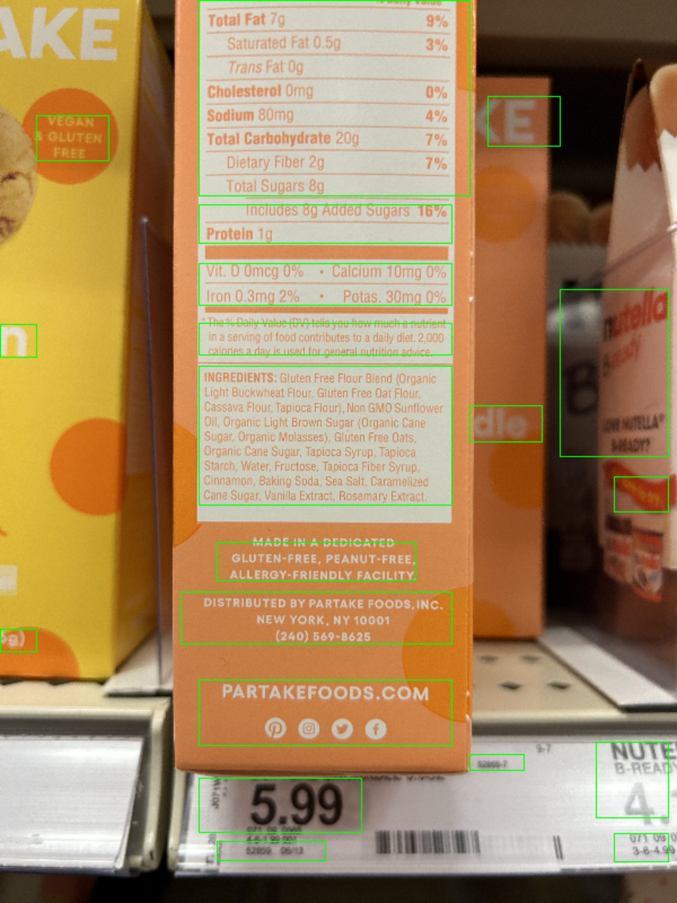
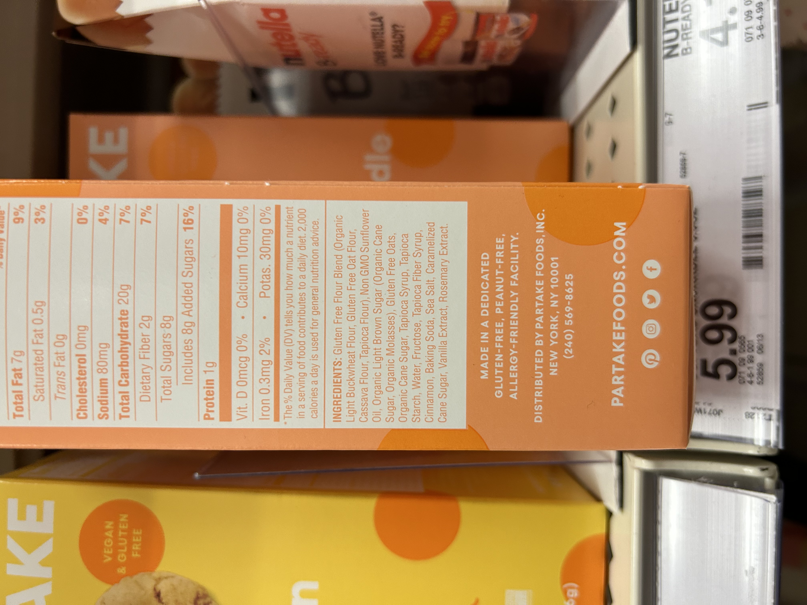
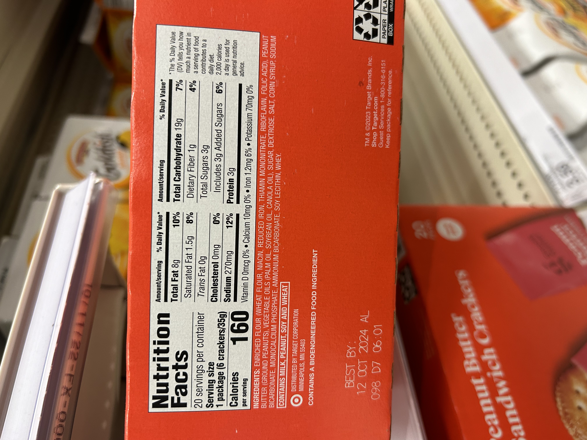

# ingredients-label-detector

## Pipeline

There are three parts to the ingredients extraction process: text detection, 
text extraction (OCR), and ingredient identification.

### Text Detection

I am using a <a
href="https://github.com/eragonruan/text-detection-ctpn">connectionist text
proposal network (CTPN)</a> to detect the locations of text lines within a
given image.

Doing so with nutrition labels introduced a new issue: individual lines within large
blocks of text such as ingredient lists would sometimes remain undetected. After
initial text line detection, I merged nearby text
boxes so the resulting bounding boxes would encompass text paragraphs. This
prevents these initially skipped lines from being ignored.

### Text Extraction (OCR)

I am using OpenCV for image preprocessing Tesseract OCR for text
recognition. The varied stylization of ingredient lists (dark text on a light background,
light text on a light background, 'gradient' lighting on cylindrical containers, etc.)
is handled by passing the image through three different preprocessing variations.
Each variation is then cropped using the bounding box specifications of the
text detection step and passed through the OCR.

The result is three large strings containing the text information of each
preprocessed image, one of which is the best. This depends on which
preprocessing filter was most suited to the given image.

### Text Determination and Postprocessing

Given each line of text detected in the image, it is necessary to determine which
lines correspond to the ingredients list and which lines do not. To do so, I
fine-tuned a <a
href="https://huggingface.co/docs/transformers/en/model_doc/mobilebert">MobileBERT</a>
model on a custom dataset (`./data/training_data`) to predict whether a given
line of text belongs to an ingredients list. MobileBert is a compressed and
accelerated version of the BERT language model.

The results from each image variant are then compared, and the one with the
most ingredients identified is chosen as the most accurate. The text is processed to remove any extraneous characters the OCR may have picked up and cut to eliminate the 'contains' clause of some ingredient lists.

### Some Results

The following output is produced by these sample images: 

 

Image 1

`ingredients: gluten free flour blend (organic light buckwheat flour, gluten free oat flour, cassava flour, tapioca flour), non gmo sunflowe: oil, organic light brown sugar (organic cane sugar, organic molasses), gluten free oats, organic cane sugar, tapioca syrup, tapioca starch, water, fructose, tapioca fiber syrup, cinnamon, baking soda, sea salt, caramelized cane sugar, vanilla extract, rosemary extract`

Image 2

`ingredients: enriched flour (wheat flour, niacin, reduced iron, thiamin mononitrate, riboflavin, folic acid), peanut butter (ground peanuts), vegetable oils (palm oil, soybean oil, canola oil), sugar, dextrose, salt, corn syrup, sodium bicarbonate, monocalcium phosphate, ammonium bicarbonate, soy lecithin, whey`

## How to Run

1. Clone this repository
2. Download the frozen cptn file for text line recognition <a href="https://github.com/eragonruan/text-detection-ctpn/releases/download/untagged-48d74c6337a71b6b5f87/ctpn.pb">here</a>
3. Save the model in `./data`
4. Add any desired testing images in `./data/raw_images`
4. Run `python ./scripts/run_ingredients_detection.py` and answer terminal
   prompts.

If you want to run individual stages of the ingredients detection process, you can
also run: 
- `python ./scripts/text_detection.py` for text detection
- `python ./scripts/text_extraction.py` for text extraction
- `python ./scripts/text_determination.py` for text determination: the classification of text lines as
  components of an ingredients list.

## Requirements

1. Tensorflow
2. Torch
3. Transformers
4. OpenCV
5. PyTesseract
6. Pillow
7. Numpy
8. Regex
